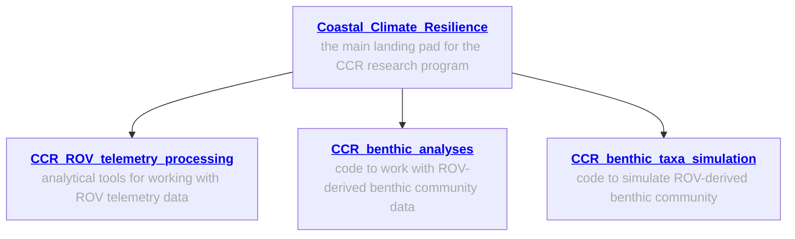
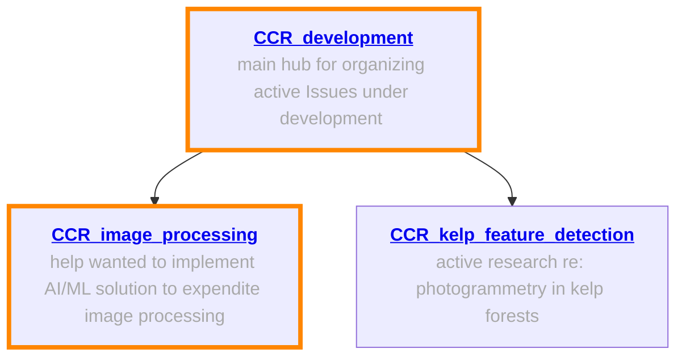

# CCR development 

This repo serves as a landing pad for active areas of development of our Coastal Climate Resilience (CCR) program. Specifically, this repo houses 1-pager .md documents ready for development, and also a hub to communicate via the **Issues** tab. 

### 1-pager project descriptions 
<table>
  <tr> <td> <b> <a href="https://github.com/Seattle-Aquarium/CCR_development/blob/main/1-pagers/AI-ML_image_processing.md"> AI/ML to process .GPR photos </a> </b> </td> <td> Explore AI/ML methods to use raw .GPR input and processed .JPEG outputs to train a model to assist with photo processing, our most rate-limiting step </td> </tr>
  <tr> <td> <b> <a href="https://github.com/zhrandell/Seattle_Aquarium_CCR_development/blob/main/1-pagers/bull_kelp_tracking.md"> bull_kelp_tracking </a> </b> </td> <td> Identify a computer vision path forward for detecting and tracking bull kelp stipes </td> </tr>
  <tr> <td> <a href="https://github.com/zhrandell/Seattle_Aquarium_CCR_development/blob/main/1-pagers/localization_fixit.md"> <b> ArduSub Localization Fixit </b> </a> </td> <td> BlueOS extension to diagnose and fix common localization problems </td> </tr>
 </table>

<!---  <tr> <td> <a href="URL"> <b> TITLE </b> </a> </td> <td> DESCRIPTION </td> </tr>  -->

# CCR GitHub repos

## General information; workflows ready to implement
The following repos contain general information about our work, and specialized repos for ROV telemetry analyses, processing and analyses of ROV-derived benthic abundance and distribution data, and simulating benthic data.  

## Help wanted! 
The following repos involve active areas of open-source software development, AI/ML implementation, and computer vision challenges; areas where we could use assistance are 🔶 highlighted in orange 🔶

